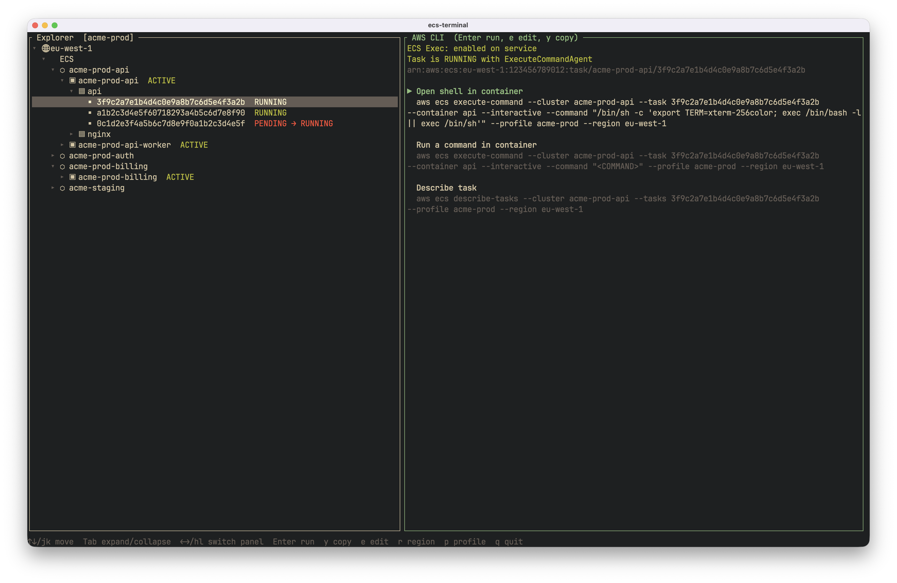

# ecsterm

Browse ECS clusters › services › containers › tasks and run the matching AWS CLI commands.



Requires the [AWS CLI v2](https://docs.aws.amazon.com/cli/latest/userguide/getting-started-install.html) and the [Session Manager plugin](https://docs.aws.amazon.com/systems-manager/latest/userguide/session-manager-working-with-install-plugin.html) for container shells.

## Install

### macOS

```
brew install aronjohanns/tap/ecsterm
```

### Linux / macOS

```
curl --proto '=https' --tlsv1.2 -LsSf https://github.com/aronjohanns/ecsterm/releases/latest/download/ecsterm-installer.sh | sh
```

### Windows

```
powershell -ExecutionPolicy Bypass -c "irm https://github.com/aronjohanns/ecsterm/releases/latest/download/ecsterm-installer.ps1 | iex"
```

### Cargo

```
cargo install ecsterm
```

Binaries are on the [releases page](https://github.com/aronjohanns/ecsterm/releases).

```
ecsterm [--profile NAME] [--region REGION] [--config PATH]
```

## Config

Linux/macOS: `~/.config/ecsterm/config.toml` (or `$XDG_CONFIG_HOME`). Windows: `%APPDATA%\ecsterm\config.toml`.

```
mkdir -p ~/.config/ecsterm && ecsterm --dump-config > ~/.config/ecsterm/config.toml
```

Actions per level: `[[ecs]]` `[[cluster]]` `[[service]]` `[[container]]` `[[task]]`. A level you define replaces its defaults.

Placeholders: `{aws}` `{profile}` `{region}` `{cluster}` `{cluster_arn}` `{service}` `{service_arn}` `{task_definition}` `{container}` `{task}` `{task_arn}`. `<TEXT>` prompts before running. `when = "exec_disabled"` hides an action unless ECS Exec is off.

Example, a shell with completion (bash + TERM, falls back to sh):

```toml
[[task]]
title = "Open shell in container"
command = "aws ecs execute-command --cluster {cluster} --task {task} --container {container} --interactive --command \"/bin/sh -c 'export TERM=xterm-256color; exec /bin/bash -l || exec /bin/sh'\" {aws}"
```
